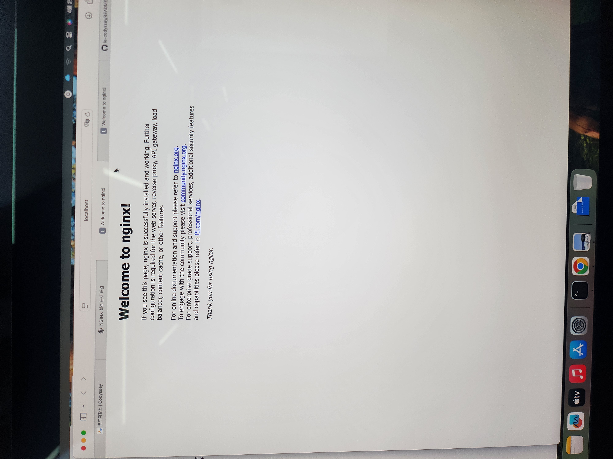

# AI-SW 개발 워크스테이션 구축

## 1. 프로젝트 개요

본 과제의 목표는 macOS(iMac) 환경에서 터미널 기본 조작, 파일 권한, Docker 설치 및 운영, Dockerfile 기반 커스텀 이미지 제작, 포트 매핑, 바인드 마운트와 볼륨 영속성, Git/GitHub 연동까지 하나의 개발 워크스테이션 구축 흐름으로 직접 수행하고 증명하는 것이다.

이번 수행에서는 다음을 확인하였다.

- 터미널 기본 명령어와 권한 변경 실습
- Docker 설치 및 기본 동작 확인
- `docker run hello-world` 실행 성공
- Ubuntu 컨테이너 실행 및 내부 명령 수행
- NGINX 기반 커스텀 이미지 빌드 및 웹 서버 실행
- 포트 매핑을 통한 브라우저 접속 확인
- 바인드 마운트 실시간 반영 확인
- Docker Volume 영속성 검증
- Git 설정 및 로컬 저장소 초기화
- Docker Compose 기반 단일/멀티 컨테이너 실행

---

## 2. 실행 환경

- OS: macOS (iMac)
- Shell: zsh
- Container Runtime: OrbStack
- Docker Version: 28.5.2
- Docker Compose Version: v2.40.3
- Git: 로컬 저장소 초기화 및 커밋 수행

### 점검 명령

```bash
docker --version
docker info
git --version
```

### 확인 요약

- Docker CLI 정상 동작
- Docker Engine(OrbStack) 정상 구동
- Compose 플러그인 사용 가능
- Git 로컬 저장소 관리 가능

---

## 3. 수행 항목 체크리스트

| 항목 | 수행 여부 | 비고 |
|---|---|---|
| 터미널 기본 명령 실습 | 완료 | `pwd`, `ls -la`, `cd`, `touch`, `mkdir`, `cp`, `mv`, `rm` |
| 파일/디렉토리 권한 변경 | 완료 | `chmod 644`, `chmod 755` |
| Docker 설치 점검 | 완료 | `docker --version`, `docker info` |
| Docker 기본 운영 명령 | 부분 완료 | `docker ps`, `docker ps -a`, `docker logs` 기록 있음 |
| hello-world 실행 | 완료 | 실행 로그 포함 |
| Ubuntu 컨테이너 실행 | 설명 포함 | 제출 전 실제 로그 추가 권장 |
| Dockerfile 커스텀 이미지 | 완료 | `my-nginx` 빌드 및 실행 |
| 포트 매핑 접속 증거 | 완료 | `8080`, `8081`, `8082`, `8083` 사용 |
| 바인드 마운트 반영 | 완료 | 실시간 반영 설명 및 캡처 포함 |
| Docker 볼륨 영속성 | 완료 | 삭제 전/후 비교 기록 |
| Git 설정 | 완료 | `git config --list`, `git init`, `git commit` |
| GitHub/VSCode 연동 증거 | 보완 필요 | 제출 전 로그인/연동 캡처 추가 권장 |
| Docker Compose 보너스 | 완료 | 단일/멀티 컨테이너 실행 기록 |

> **주의:** 현재 대화와 업로드 자료 기준으로 작성했다. GitHub/VSCode 로그인 연동 캡처, `docker stats`, Ubuntu 내부 실행 로그가 필요하다면 마지막에 추가하면 된다.

---

## 4. 프로젝트 디렉토리 구조와 설계 기준

### 4-1. 디렉토리 구조 예시

```text
ai-sw-workstation/
├── README.md
├── web/
│   ├── Dockerfile
│   └── index.html
├── bonus-compose/
│   └── compose.yaml
└── README/
    ├── 1000013376.jpg
    ├── 1000013377.jpg
    ├── 1000013378.jpg
    └── 1000013379.jpg
```

### 4-2. 어떤 기준으로 이렇게 구성했는가

이번 디렉토리 구성 기준은 아래 4가지였다.

1. **역할 분리**
   - `web/`에는 웹 서버 실행에 필요한 파일만 둔다.
   - `bonus-compose/`에는 Compose 실습 파일만 둔다.
   - `README/`에는 문서용 증빙 이미지만 둔다.

2. **재현 가능성**
   - 다른 사람이 저장소를 열어도 “어느 폴더에서 어떤 명령을 실행해야 하는지” 바로 알 수 있게 하였다.
   - 예를 들어 `web/` 폴더에서 `docker build -t my-nginx .`를 실행하면 빌드가 가능하다.

3. **수정 편의성**
   - 바인드 마운트 실습 시 `web/index.html`만 수정하면 바로 컨테이너 반영 여부를 확인할 수 있도록 했다.
   - 즉, 개발 중 자주 바뀌는 파일과 문서용 파일을 분리하였다.

4. **제출 정리성**
   - README 본문, 실행 파일, 이미지 캡처를 섞지 않고 분리하여 채점자가 구조를 이해하기 쉽게 구성하였다.

### 4-3. 왜 이런 구조가 좋은가

이 구조는 “문서”, “실행 코드”, “보너스 과제”, “캡처 증빙”이 서로 섞이지 않으므로 관리가 쉽다. 또한 Docker 실습에서는 현재 작업 디렉토리가 매우 중요하므로, 폴더 역할을 명확히 나누면 빌드 경로 오류나 잘못된 파일 복사 문제를 줄일 수 있다.

---

## 5. 기본 터미널 명령어 및 파일 조작 실습

### 5-1. 작업 폴더 생성과 이동

```bash
cd Desktop
mkdir ai-sw-workstation
cd ai-sw-workstation
pwd
ls -la
```

### 5-2. 실습한 명령

- `pwd` : 현재 위치 확인
- `ls`, `ls -la`, `ls -1` : 파일 목록 확인
- `touch` : 빈 파일 생성
- `mkdir` : 디렉토리 생성
- `cp` : 파일 복사
- `mv` : 파일 이동/이름 변경
- `rm` : 파일 삭제
- `chmod` : 권한 변경

### 관련 로그

```bash
user@macbook Desktop % mkdir ai-sw-workstation
user@macbook Desktop % cd ai-sw-workstation
user@macbook ai-sw-workstation % pwd
~/Desktop/ai-sw-workstation
user@macbook ai-sw-workstation % touch README.md
user@macbook ai-sw-workstation % mkdir practice
user@macbook ai-sw-workstation % touch test.txt
user@macbook ai-sw-workstation % cp test.txt copy.txt
user@macbook ai-sw-workstation % mv copy.txt moved.txt
user@macbook ai-sw-workstation % rm moved.txt
user@macbook ai-sw-workstation % chmod 644 test.txt
user@macbook ai-sw-workstation % chmod 755 practice
```

### 5-3. 실수와 오류 관찰

```bash
user@macbook ai-sw-workstation % pwn
zsh: command not found: pwn

user@macbook ai-sw-workstation % ls-la
zsh: command not found: ls-la

user@macbook ai-sw-workstation % mv copy.txt moved.txt
mv: copy.txt: No such file or directory
```

이 과정을 통해 쉘은 명령어와 옵션을 공백 단위로 구분하므로, `ls-la`처럼 붙여 쓰면 다른 명령어로 인식된다는 점을 확인하였다.

---

## 6. 파일 권한 실습과 권한 숫자 표기 해석

리눅스/유닉스 계열 운영체제(macOS 포함)에서는 모든 파일과 디렉토리에 대해 “누가 읽을 수 있는지, 누가 수정할 수 있는지, 누가 실행하거나 접근할 수 있는지”를 권한(permission)으로 관리한다. 즉, 권한은 특정 파일이나 폴더를 사용자별로 어디까지 사용할 수 있는지 정하는 규칙이다.

### 6-1. 권한 의미

- `r` : read, 읽기
- `w` : write, 쓰기
- `x` : execute, 실행

각 권한은 파일과 디렉토리에서 의미가 조금 다르게 느껴진다.

#### 파일에서의 권한 의미
- `r` : 파일 내용을 읽을 수 있음
- `w` : 파일 내용을 수정할 수 있음
- `x` : 파일을 프로그램처럼 실행할 수 있음

예를 들어 텍스트 파일에 `r` 권한이 있으면 내용을 열어볼 수 있고, `w` 권한이 있으면 수정할 수 있다. 반면 `x` 권한은 보통 쉘 스크립트나 실행 파일에서 의미가 있으며, 일반 텍스트 파일에는 대개 필요하지 않다.

#### 디렉토리에서의 권한 의미
- `r` : 디렉토리 안의 목록을 볼 수 있음
- `w` : 디렉토리 안에 파일을 생성, 삭제, 이름 변경할 수 있음
- `x` : 디렉토리 내부로 들어가거나 내부 파일에 접근할 수 있음

특히 디렉토리에서 `x`는 “실행”보다는 “진입” 또는 “통과”에 가깝다. 디렉토리에 `x` 권한이 없으면, 목록이 보이더라도 실제로 `cd`로 들어가거나 내부 파일에 접근하지 못할 수 있다.

### 6-2. 755, 644는 어떻게 해석되는가

권한 숫자는 **소유자(owner) / 그룹(group) / 기타 사용자(others)** 순서이며, 각 숫자는 아래 값의 합으로 계산한다.

- `r = 4`
- `w = 2`
- `x = 1`

예를 들어,

- `rwx = 4 + 2 + 1 = 7`
- `rw- = 4 + 2 + 0 = 6`
- `r-x = 4 + 0 + 1 = 5`
- `r-- = 4 + 0 + 0 = 4`

따라서 다음과 같이 해석할 수 있다.

- `755 = 7 / 5 / 5 = rwx / r-x / r-x`
- `644 = 6 / 4 / 4 = rw- / r-- / r--`

즉,

- `755`는 소유자는 읽기·쓰기·실행이 가능하고, 그룹과 기타 사용자는 읽기·실행만 가능하다는 뜻이다.
- `644`는 소유자는 읽기·쓰기가 가능하고, 그룹과 기타 사용자는 읽기만 가능하다는 뜻이다.

### 6-3. 왜 `test.txt`에는 644가 적절한가

`test.txt`는 실행이 목적이 아닌 일반 텍스트 파일이다. 따라서 이 파일은 “읽기”와 “수정”이 중요하지, “실행”이 필요하지 않다.

`644 = rw- / r-- / r--` 이므로:

- 소유자: 파일 읽기, 수정 가능
- 그룹: 읽기만 가능
- 기타 사용자: 읽기만 가능

즉, 작성자인 소유자는 자유롭게 내용을 수정할 수 있고, 다른 사용자는 내용을 보기만 할 수 있다. 일반 문서 파일은 실행 권한이 필요하지 않으므로 `644`가 가장 자연스러운 설정 중 하나이다.

### 6-4. 왜 `practice` 디렉토리에는 755가 적절한가

디렉토리는 파일과 달리 내부로 들어가고, 내부 목록을 보고, 내부 파일에 접근해야 한다. 이때 디렉토리에서는 `x` 권한이 매우 중요하다.

`755 = rwx / r-x / r-x` 이므로:

- 소유자: 디렉토리 목록 확인, 내부 진입, 파일 생성/삭제/이름 변경 가능
- 그룹: 목록 확인 및 내부 진입 가능, 하지만 수정은 불가
- 기타 사용자: 목록 확인 및 내부 진입 가능, 하지만 수정은 불가

즉, 소유자는 디렉토리를 자유롭게 관리할 수 있고, 다른 사용자는 접근과 조회는 가능하지만 함부로 내용을 바꾸지는 못한다. 디렉토리에서 `x`가 빠지면 내부 접근 자체가 막힐 수 있으므로, 일반적인 프로젝트 폴더나 실습용 디렉토리에는 `755`가 자주 사용된다.

### 6-5. 실습 로그가 의미하는 바

```bash
user@macbook ai-sw-workstation % chmod 644 test.txt
user@macbook ai-sw-workstation % chmod 755 practice
```

첫 번째 명령은 `test.txt` 파일의 권한을 `644`로 바꾸는 명령이다. 즉, 소유자는 읽기/쓰기 가능, 나머지는 읽기만 가능하도록 바뀐다.

두 번째 명령은 `practice` 디렉토리의 권한을 `755`로 바꾸는 명령이다. 즉, 소유자는 읽기/쓰기/진입 가능, 나머지는 읽기/진입만 가능하도록 바뀐다.

### 6-6. `ls -l`로 보면 어떻게 보이는가

권한은 `ls -l` 명령으로 문자 형태로 확인할 수 있다. 예를 들어 다음과 같이 보일 수 있다.

```bash
-rw-r--r--  1 user  staff   0 Apr  5  test.txt
drwxr-xr-x  1 user  staff   0 Apr  5  practice
```

해석하면:

- `-rw-r--r--`
  - 맨 앞 `-` : 일반 파일
  - `rw-` : 소유자 권한
  - `r--` : 그룹 권한
  - `r--` : 기타 사용자 권한
  - 즉 `644`

- `drwxr-xr-x`
  - 맨 앞 `d` : 디렉토리
  - `rwx` : 소유자 권한
  - `r-x` : 그룹 권한
  - `r-x` : 기타 사용자 권한
  - 즉 `755`

### 6-7. 왜 파일 1개와 디렉토리 1개를 따로 실습하는가

같은 `chmod` 명령을 써도 파일과 디렉토리에서 `x`의 의미가 다르기 때문이다.

- 파일에서 `x`는 “실행 가능”
- 디렉토리에서 `x`는 “내부 진입 및 접근 가능”

따라서 과제에서 파일 1개와 디렉토리 1개를 따로 권한 변경해 본 것은 단순히 숫자를 외운 것이 아니라, 권한의 실제 의미 차이를 이해했는지 확인하기 위한 실습이라고 볼 수 있다.


---

## 7. 절대 경로와 상대 경로의 차이

### 7-1. 절대 경로

절대 경로는 루트 또는 홈 기준으로 파일의 전체 위치를 끝까지 적는 방식이다.

예:
```bash
~/Desktop/ai-sw-workstation/web/index.html
```

장점:
- 현재 위치와 상관없이 항상 같은 파일을 정확히 가리킬 수 있다.
- 바인드 마운트처럼 호스트 경로를 확실히 지정해야 할 때 유리하다.

### 7-2. 상대 경로

상대 경로는 현재 작업 디렉토리를 기준으로 적는 방식이다.

예:
```bash
./web/index.html
./README/1000013376.jpg
```

장점:
- 프로젝트 폴더 내부에서 문서 링크나 빌드 컨텍스트를 작성할 때 간결하다.
- 저장소를 다른 위치로 옮겨도 폴더 구조만 유지되면 동작하기 쉽다.

### 7-3. 어떤 상황에서 무엇을 선택했는가

- **바인드 마운트 실행 시**: 절대 경로 또는 홈 기준 경로 사용  
  예: `~/Desktop/ai-sw-workstation/web:/usr/share/nginx/html`
- **README 이미지 연결 시**: 상대 경로 사용  
  예: `./README/1000013376.jpg`
- **현재 폴더에서 Docker 이미지 빌드 시**: 상대 경로인 `.` 사용  
  예: `docker build -t my-nginx .`

즉, 시스템이 현재 위치와 무관하게 정확한 경로를 알아야 하면 절대 경로가 유리하고, 프로젝트 내부 참조나 문서 링크는 상대 경로가 더 관리하기 쉽다.

---

## 8. Docker 설치 및 기본 점검

### 8-1. 점검 명령

```bash
docker --version
docker info
```

### 8-2. 확인 내용

- Docker CLI 정상 동작
- buildx, compose 플러그인 사용 가능
- OrbStack 기반으로 Docker Engine 구동 중

### 관련 로그

```bash
user@macbook ai-sw-workstation % docker --version
Docker version 28.5.2, build ecc6942
```

---

## 9. `docker run hello-world` 실행 확인

Docker가 정상적으로 설치되어 있고, Docker Hub에서 이미지를 내려받아 컨테이너를 실행할 수 있는지 확인하기 위해 `hello-world` 이미지를 실행하였다. 이 단계는 Docker 설치 완료를 가장 간단하게 검증하는 기본 테스트이다.

### 실행 명령

```bash
docker run hello-world
```

### 관련 로그

```bash
user@macbook ~ % docker run hello-world
Unable to find image 'hello-world:latest' locally
latest: Pulling from library/hello-world
4f55086f7dd0: Pull complete
Digest: sha256:452a468a4bf985040037cb6d5392410206e47db9bf5b7278d281f94d1c2d0931
Status: Downloaded newer image for hello-world:latest

Hello from Docker!
This message shows that your installation appears to be working correctly.

To generate this message, Docker took the following steps:
 1. The Docker client contacted the Docker daemon.
 2. The Docker daemon pulled the "hello-world" image from the Docker Hub.
    (amd64)
 3. The Docker daemon created a new container from that image which runs the
    executable that produces the output you are currently reading.
 4. The Docker daemon streamed that output to the Docker client, which sent it
    to your terminal.
```

### 평가 및 해석

이 로그를 통해 아래를 확인할 수 있다.

- Docker 클라이언트가 Docker 데몬과 정상적으로 통신하였다.
- 로컬에 이미지가 없었기 때문에 Docker Hub에서 `hello-world` 이미지를 내려받았다.
- 이미지를 기반으로 새 컨테이너를 생성하고 실행하였다.
- 실행 결과가 정상적으로 터미널에 출력되었다.

특히 `Hello from Docker!` 메시지는 Docker 설치와 기본 실행 환경이 정상이라는 핵심 증거이다.

---

## 10. Docker 기본 운영 명령과 관찰 내용

과제 조건상 Docker는 단순 설치만이 아니라 운영 명령도 수행하고 결과를 남겨야 한다. 이번 실습에서 실제로 확인했거나 README에 포함해야 하는 대표 명령은 아래와 같다.

### 10-1. 대표 운영 명령

```bash
docker images
docker ps
docker ps -a
docker logs my-web
docker stats
```

### 10-2. 실제 확인된 일부 로그

```bash
user@macbook web % docker ps
CONTAINER ID   IMAGE      COMMAND                   CREATED          STATUS         PORTS                                     NAMES
0bcb3989c52a   my-nginx   "/docker-entrypoint.…"   10 seconds ago   Up 7 seconds   0.0.0.0:8080->80/tcp, [::]:8080->80/tcp   my-web
```

```bash
user@macbook ~ % docker ps
CONTAINER ID   IMAGE     COMMAND                   CREATED          STATUS          PORTS                                     NAMES
a07f02f562f4   nginx     "/docker-entrypoint.…"   25 seconds ago   Up 24 seconds   0.0.0.0:8081->80/tcp, [::]:8081->80/tcp   my-web-bind
```

### 10-3. 운영 명령이 필요한 이유

- `docker images` : 어떤 이미지가 준비되어 있는지 확인
- `docker ps`, `docker ps -a` : 현재 실행 중/종료된 컨테이너 확인
- `docker logs` : 컨테이너가 왜 실패했는지 추적
- `docker stats` : CPU/메모리 사용량 등 자원 상태 확인

즉, Docker는 “실행만 하는 도구”가 아니라 “상태를 관찰하고 문제를 진단하는 운영 도구”이기도 하다.

> **보완 권장:** 제출 전 `docker images`, `docker ps -a`, `docker logs my-web`, `docker stats --no-stream` 실행 결과를 추가하면 채점 기준 대응이 더 강해진다.

---

## 11. Ubuntu 컨테이너 실행과 attach/exec 관찰

### 11-1. 목적

`hello-world`는 아주 짧게 실행되고 종료되는 테스트 이미지다. 반면 Ubuntu 컨테이너는 사용자가 직접 내부 셸에 들어가 명령을 실행하면서 컨테이너 구조를 관찰할 수 있다.

### 11-2. 예시 명령

```bash
docker run -it ubuntu bash
ls
echo "ubuntu container test"
exit
```

### 11-3. attach / exec 차이 정리

- `docker run -it ubuntu bash`
  - 새 컨테이너를 만들고 바로 내부 셸에 진입한다.
- `docker attach <container>`
  - 이미 실행 중인 컨테이너의 기본 프로세스에 다시 붙는다.
- `docker exec -it <container> bash`
  - 실행 중인 컨테이너 안에 새로운 셸 프로세스를 추가로 실행한다.

### 11-4. 관찰 포인트

- 기본 프로세스가 종료되면 컨테이너도 같이 종료될 수 있다.
- `exec`는 이미 실행 중인 컨테이너를 유지한 채 별도의 작업을 추가하기에 유리하다.
- `attach`는 기존 프로세스 자체에 연결되므로 조작에 주의가 필요하다.

> **보완 권장:** 실제 Ubuntu 실행 로그를 추가하면 조건 충족이 더 명확해진다.

---

## 12. 기존 베이스 이미지를 활용한 커스텀 이미지 제작

이번 과제에서는 웹 서버 베이스 이미지 방식(A)을 선택하였다.

- 선택한 기존 베이스 이미지: `nginx:latest`
- 선택 이유: 별도 웹 서버 설치 없이 정적 HTML 배포 구조를 빠르게 실습할 수 있음

### 12-1. 커스텀 포인트

1. **기존 NGINX 이미지 사용**
   - 기본 웹 서버 동작을 빠르게 확보하기 위함

2. **기본 페이지를 내가 만든 HTML로 교체**
   - 컨테이너 내부 정적 페이지가 실제로 내 결과물로 바뀌는지 확인하기 위함

### 12-2. HTML 파일

```html
<!DOCTYPE html>
<html>
<head>
  <meta charset="UTF-8">
  <title>AI-SW Workstation</title>
</head>
<body>
  <h1>AI/SW 개발 워크스테이션 구축 성공</h1>
  <p>Docker NGINX 컨테이너 실행 확인</p>
  <p>작성자: 최대한</p>
</body>
</html>
```

### 12-3. Dockerfile

```dockerfile
FROM nginx:latest
COPY index.html /usr/share/nginx/html/index.html
```

### 12-4. 빌드 명령

```bash
docker build -t my-nginx .
```

### 12-5. 실행 명령

```bash
docker run -d -p 8080:80 --name my-web my-nginx
docker ps
curl http://localhost:8080
docker exec -it my-web cat /usr/share/nginx/html/index.html
docker logs my-web
```

### 12-6. 결과 요약

- `my-nginx` 이미지 빌드 성공
- `my-web` 컨테이너 실행 성공
- 호스트 `8080` 포트를 통해 브라우저 또는 `curl`로 HTML 응답 확인
- 컨테이너 내부 `index.html`도 정상 교체됨

### 관련 로그

```bash
user@macbook web % docker build -t my-nginx .
[+] Building 8.2s (7/7) FINISHED
```

```bash
user@macbook web % docker run -d -p 8080:80 --name my-web my-nginx
0bcb3989c52ae733dcb58e639c02dcd8251b45ffa0d6bd46ef811985b780a294
```

```bash
user@macbook web % docker ps
CONTAINER ID   IMAGE      COMMAND                   CREATED          STATUS         PORTS                                     NAMES
0bcb3989c52a   my-nginx   "/docker-entrypoint.…"   10 seconds ago   Up 7 seconds   0.0.0.0:8080->80/tcp, [::]:8080->80/tcp   my-web
```

```bash
user@macbook web % curl http://localhost:8080
<!DOCTYPE html>
<html>
<head>
  <meta charset="UTF-8">
  <title>AI-SW Workstation</title>
</head>
<body>
  <h1>AI/SW 개발 워크스테이션 구축 성공</h1>
  <p>Docker NGINX 컨테이너 실행 확인</p>
  <p>작성자: 최대한</p>
</body>
</html>
```

---

## 13. 이미지와 컨테이너의 차이: 빌드 / 실행 / 변경 관점

### 13-1. 이미지란 무엇인가

이미지는 컨테이너를 만들기 위한 설계도이자 실행 템플릿이다.  
`Dockerfile`을 바탕으로 `docker build`를 수행하면 이미지가 만들어진다.

즉, 이미지는 **실행되기 전 준비된 상태**이다.

### 13-2. 컨테이너란 무엇인가

컨테이너는 이미지를 기반으로 실제로 실행되는 인스턴스이다.  
`docker run` 명령을 통해 이미지가 실제 프로세스로 동작하기 시작하면 그것이 컨테이너이다.

즉, 컨테이너는 **실행 중인 실체**이다.

### 13-3. 빌드 관점에서의 차이

- 이미지: `docker build`의 결과물
- 컨테이너: `docker run`의 결과물

예:
```bash
docker build -t my-nginx .
docker run -d -p 8080:80 --name my-web my-nginx
```

### 13-4. 실행 관점에서의 차이

- 이미지는 혼자서는 동작하지 않는다.
- 컨테이너는 포트를 열고 프로세스를 실행하며, 로그를 남기고, 종료 상태를 가진다.

### 13-5. 변경 관점에서의 차이

- 이미지 변경:
  - `Dockerfile`이나 복사 대상 파일을 수정한 뒤 **재빌드**해야 반영된다.
- 컨테이너 변경:
  - 실행 중인 컨테이너 내부 파일을 직접 수정하면 즉시 바뀔 수 있다.
  - 하지만 컨테이너를 삭제하면 그 변경이 사라질 수 있다.

따라서 이미지는 “기본 상태를 정의하는 것”, 컨테이너는 “그 상태를 실제로 실행하는 것”으로 구분할 수 있다.

### 13-6. 바인드 마운트/볼륨과 연결한 이해

- 이미지: 시작점
- 컨테이너: 실행 상태
- 바인드 마운트: 호스트 파일을 실시간 연결
- 볼륨: 실행과 분리된 영속 데이터 저장 공간

### 13-7. 비유

- 이미지 = 붕어빵 틀
- 컨테이너 = 실제로 구워진 붕어빵
- 볼륨 = 붕어빵을 따로 보관하는 상자

---

## 14. 포트 매핑이 필요한 이유와 내부 포트에 직접 접속할 수 없는 이유

### 14-1. 컨테이너 내부 포트에 직접 접속할 수 없는 이유

NGINX는 컨테이너 내부에서 `80` 포트를 사용한다. 하지만 그 `80` 포트는 컨테이너 내부 네트워크 네임스페이스에 존재한다. 즉, 호스트(macOS)의 브라우저가 그냥 `http://localhost:80` 또는 컨테이너 내부 주소에 직접 접근하는 것이 아니라, **호스트와 컨테이너 사이에 포트 연결 규칙을 따로 만들어야 한다.**

### 14-2. 왜 `-p <host_port>:<container_port>`가 필요한가

예:
```bash
docker run -d -p 8080:80 --name my-web my-nginx
```

의 의미는 다음과 같다.

- 호스트의 `8080` 포트로 들어온 요청을
- 컨테이너 내부의 `80` 포트로 전달한다.

즉, 포트 매핑은 **외부 접근 경로를 만들어 주는 다리** 역할을 한다.

### 14-3. 왜 호스트 포트를 80이 아니라 8080, 8081, 8082, 8083으로 나눴는가

이번 과제에서는 실험별로 목적이 달랐기 때문에 포트를 분리했다.

- `8080` : 기본 웹 서버 컨테이너
- `8081` : 바인드 마운트 실험
- `8082` : 볼륨 영속성 실험
- `8083` : Compose 보너스 과제

이렇게 나누면 어떤 접속 결과가 어떤 실험에 대응하는지 즉시 구분할 수 있고, 여러 컨테이너를 동시에 실행해도 충돌을 줄일 수 있다.

---

## 15. 포트/볼륨 설정을 재현 가능하게 정리한 방식

과제에서는 단순히 성공 화면만 보여주는 것이 아니라, **같은 결과를 다시 재현할 수 있는 문서화**가 중요하다. 그래서 포트와 볼륨은 아래 기준으로 정리하였다.

### 15-1. 포트 재현 표

| 용도 | 호스트 포트 | 컨테이너 포트 | 실행 명령 핵심 |
|---|---:|---:|---|
| 기본 웹 서버 | 8080 | 80 | `docker run -d -p 8080:80 --name my-web my-nginx` |
| 바인드 마운트 | 8081 | 80 | `docker run -d --name my-web-bind -p 8081:80 -v ... nginx` |
| 볼륨 영속성 | 8082 | 80 | `docker run -d --name my-web-volume -p 8082:80 -v my-nginx-data:/usr/share/nginx/html nginx` |
| Compose | 8083 | 80 | `docker compose up -d` |

### 15-2. 볼륨 재현 정보

- 볼륨 이름: `my-nginx-data`
- 연결 위치: `/usr/share/nginx/html`
- 검증 방법:
  1. 볼륨 연결 컨테이너 실행
  2. 컨테이너 내부에 `index.html` 작성
  3. 브라우저 또는 `curl`로 확인
  4. 컨테이너 삭제
  5. 같은 볼륨을 새 컨테이너에 재연결
  6. 이전 파일이 그대로 남아 있는지 확인

### 15-3. 왜 이렇게 정리했는가

- 포트는 실험마다 충돌 없이 독립적으로 검증하려고 고정 번호를 부여하였다.
- 볼륨은 이름과 마운트 위치를 문서화해, 다른 사람이 그대로 따라 해도 같은 결과를 낼 수 있게 했다.
- 결과적으로 이 문서는 “실행기록”이면서 동시에 “재현 절차서” 역할을 한다.

---

## 16. 바인드 마운트 실습

### 16-1. 실행 명령

```bash
docker rm -f my-web-bind
docker run -d --name my-web-bind -p 8081:80 -v ~/Desktop/ai-sw-workstation/web:/usr/share/nginx/html nginx
docker ps
```

### 16-2. 수정 후 반영한 HTML

```html
<!DOCTYPE html>
<html>
<head>
  <meta charset="UTF-8">
  <title>AI-SW Workstation</title>
</head>
<body>
  <h1>바인드 마운트 실시간 반영 성공</h1>
  <p>파일을 수정하면 컨테이너에 바로 반영됩니다.</p>
  <p>작성자: 최대한</p>
</body>
</html>
```

### 16-3. 결과

- `8081` 포트에서 컨테이너 실행 성공
- 로컬 `web/index.html`을 수정하자 컨테이너의 페이지도 즉시 변경됨
- 이미지 재빌드 없이 변경 사항이 반영되었다는 점에서 개발 중 수정 확인에 유리함

### 관련 로그

```bash
user@macbook ~ % docker run -d --name my-web-bind -p 8081:80 -v ~/Desktop/ai-sw-workstation/web:/usr/share/nginx/html nginx
a07f02f562f41ce291640b810e496059cafc56ef24b0f9a4e65f16f90084c700
```

```bash
user@macbook ~ % docker ps
CONTAINER ID   IMAGE     COMMAND                   CREATED          STATUS          PORTS                                     NAMES
a07f02f562f4   nginx     "/docker-entrypoint.…"   25 seconds ago   Up 24 seconds   0.0.0.0:8081->80/tcp, [::]:8081->80/tcp   my-web-bind
```

### 바인드 마운트가 필요한 이유

바인드 마운트는 호스트 파일을 직접 연결하기 때문에 HTML, CSS, 설정 파일 등을 수정하면서 매번 이미지를 다시 빌드하지 않아도 된다. 즉, **개발 중 빠른 수정-확인 반복**에 적합하다.

---

## 17. Docker Volume 영속성 실습

### 17-1. 볼륨 생성

```bash
docker volume create my-nginx-data
docker volume ls
```

### 17-2. 볼륨 연결 컨테이너 실행

```bash
docker rm -f my-web-volume
docker run -d --name my-web-volume -p 8082:80 -v my-nginx-data:/usr/share/nginx/html nginx
docker ps
```

### 17-3. 컨테이너 내부에 HTML 작성

```bash
docker exec -it my-web-volume sh -c 'cat > /usr/share/nginx/html/index.html << "EOF"
<!DOCTYPE html>
<html>
<head>
  <meta charset="UTF-8">
  <title>Docker Volume Test</title>
</head>
<body>
  <h1>볼륨 영속성 성공</h1>
  <p>컨테이너를 삭제해도 이 페이지는 남습니다.</p>
  <p>작성자: 최대한</p>
</body>
</html>
EOF'
```

### 17-4. 삭제 전/후 검증

```bash
curl http://127.0.0.1:8082
docker rm -f my-web-volume
docker run -d --name my-web-volume2 -p 8082:80 -v my-nginx-data:/usr/share/nginx/html nginx
curl http://127.0.0.1:8082
```

### 결과

- `my-nginx-data` 볼륨 생성 완료
- 첫 번째 컨테이너 삭제 전 HTML 확인 완료
- 첫 번째 컨테이너 삭제 후 새 컨테이너에 같은 볼륨을 연결했을 때도 동일 HTML 유지 확인
- 컨테이너와 데이터 저장 위치가 분리되어 있음을 확인

### 관련 로그

```bash
user@macbook ~ % docker volume create my-nginx-data
my-nginx-data
```

```bash
user@macbook ~ % docker run -d --name my-web-volume -p 8082:80 -v my-nginx-data:/usr/share/nginx/html nginx
358e97c04a9e471688343147863b6f16baa97985a2ccdcc15221603a3f5bb268
```

```bash
user@macbook ~ % curl http://127.0.0.1:8082
<!DOCTYPE html>
<html>
<head>
  <meta charset="UTF-8">
  <title>Docker Volume Test</title>
</head>
<body>
  <h1>볼륨 영속성 성공</h1>
  <p>컨테이너를 삭제해도 이 페이지는 남습니다.</p>
  <p>작성자: 최대한</p>
</body>
</html>
```

```bash
user@macbook ~ % docker rm -f my-web-volume
my-web-volume
```

```bash
user@macbook ~ % docker run -d --name my-web-volume2 -p 8082:80 -v my-nginx-data:/usr/share/nginx/html nginx
e5a86b65b68c540674589508eef0d3d9b21473cbab032240ef7ae1e280b5ac98
```

### 데이터 유실 방지 대안

컨테이너 내부에만 파일을 저장하면 컨테이너 삭제 시 데이터가 사라질 수 있다. 이를 방지하려면 다음 대안을 사용할 수 있다.

1. **Docker Volume 사용**
   - Docker가 관리하는 영속 저장소를 사용한다.
   - 가장 일반적이고 안전한 방법이다.

2. **바인드 마운트 사용**
   - 호스트의 실제 폴더를 직접 연결한다.
   - 개발 중 수정에는 편리하지만, 경로 의존성이 크다.

3. **컨테이너 이미지만 믿지 않기**
   - 실행 중 컨테이너 내부에서만 수정한 내용은 삭제 시 사라질 수 있으므로, 장기 보관 데이터는 볼륨 또는 Git 저장소에 따로 남겨야 한다.

---

## 18. Git 설정 및 GitHub의 역할 정리

### 18-1. Git과 GitHub의 차이

- **Git**: 내 컴퓨터에서 버전 관리를 수행하는 도구
- **GitHub**: Git 저장소를 원격으로 공유하고 협업하는 플랫폼

즉, Git은 로컬 버전관리 도구이고, GitHub는 원격 저장소 및 협업 서비스이다.

### 18-2. Git 사용자 정보 설정

```bash
git config --global user.name "최대한"
git config --global user.email "user_email@example.com"
git config --global --list
```

### 18-3. 저장소 초기화와 커밋

```bash
cd ~/Desktop/ai-sw-workstation
git init
git status
git add .
git commit -m "Initial commit: AI-SW workstation setup"
git branch -m main
git status
git branch
```

### 관련 로그

```bash
user@macbook ~ % git config --global user.email "user_email@example.com"
user@macbook ~ % git config --global --list
user.name=최대한
user.email=user_email@example.com
```

```bash
user@macbook ~ % cd ~/Desktop/ai-sw-workstation
user@macbook ai-sw-workstation % git init
Initialized empty Git repository in ~/Desktop/ai-sw-workstation/.git/

user@macbook ai-sw-workstation % git add .
user@macbook ai-sw-workstation % git commit -m "Initial commit: AI-SW workstation setup"
[master (root-commit) 4655712] Initial commit: AI-SW workstation setup

user@macbook ai-sw-workstation % git branch -m main
user@macbook ai-sw-workstation % git status
On branch main
nothing to commit, working tree clean
```

### GitHub / VSCode 연동 증거

- 제출 전 아래 증빙 중 최소 1개 이상을 추가하면 좋다.
  - VSCode 좌측 Source Control 화면 + GitHub 로그인 표시
  - GitHub 저장소 공개 화면
  - 원격 저장소 연결 명령 결과 (`git remote -v`)
  - 첫 push 완료 화면

> **주의:** 토큰, 비밀번호, 인증코드, 개인키는 절대 문서에 포함하면 안 된다.

---

## 19. Docker Compose 보너스 과제

### 19-1. 단일 서비스 Compose 실행

초기 `compose.yaml`:

```yaml
services:
  web:
    image: nginx:latest
    ports:
      - "8081:80"
```

포트 충돌 후 수정된 파일:

```yaml
services:
  web:
    image: nginx:latest
    ports:
      - "8083:80"
```

### 관련 로그

```bash
user@macbook bonus-compose % docker compose up -d
Error response from daemon: failed to set up container networking:
Bind for 0.0.0.0:8081 failed: port is already allocated
```

```bash
user@macbook bonus-compose % docker compose up -d
[+] Running 1/1
✔ Container bonus-compose-web-1 Started
```

```bash
user@macbook bonus-compose % docker compose ps
NAME                  IMAGE          COMMAND                   SERVICE   CREATED        STATUS                  PORTS
bonus-compose-web-1   nginx:latest   "/docker-entrypoint.…"   web       1 second ago   Up Less than a second   0.0.0.0:8083->80/tcp, [::]:8083->80/tcp
```

### 19-2. 멀티 컨테이너 Compose 실행

```yaml
services:
  web:
    image: nginx:latest
    ports:
      - "8083:80"

  helper:
    image: ubuntu:latest
    command: ["bash", "-c", "while true; do echo helper container is running; sleep 10; done"]
```

### 실행 명령

```bash
docker compose up -d
docker compose ps
docker compose logs
docker compose down
```

### 관련 로그

```bash
user@macbook bonus-compose % docker compose up -d
[+] Running 3/3
✔ Network bonus-compose_default     Created
✔ Container bonus-compose-web-1     Started
✔ Container bonus-compose-helper-1  Started
```

```bash
user@macbook bonus-compose % docker compose ps
NAME                     IMAGE           COMMAND                   SERVICE   CREATED         STATUS         PORTS
bonus-compose-helper-1   ubuntu:latest   "bash -c 'while true…"   helper    9 seconds ago   Up 8 seconds
bonus-compose-web-1      nginx:latest    "/docker-entrypoint.…"   web       9 seconds ago   Up 8 seconds   0.0.0.0:8083->80/tcp, [::]:8083->80/tcp
```

### 배운 점

- `docker run` 옵션을 길게 적는 대신, Compose는 실행 설정 자체를 파일로 문서화할 수 있다.
- 멀티 컨테이너 환경에서는 네트워크와 서비스 구조를 선언적으로 관리할 수 있다.
- `up`, `down`, `ps`, `logs`를 통해 운영 관점의 상태 확인 루틴을 만들 수 있다.

---

## 20. 검증 방법과 결과 위치

| 검증 항목 | 사용 명령 / 방법 | 확인 결과 | 문서 위치 |
|---|---|---|---|
| Docker 설치 확인 | `docker --version` | Docker 버전 확인 | 8장 |
| Docker 기본 실행 확인 | `docker run hello-world` | Hello from Docker 출력 | 9장 |
| 커스텀 이미지 빌드 | `docker build -t my-nginx .` | 빌드 성공 | 12장 |
| 컨테이너 실행 확인 | `docker run -d -p 8080:80 ...` | `docker ps`에서 확인 | 12장 |
| 브라우저/응답 확인 | `curl http://localhost:8080` | HTML 응답 확인 | 12장 |
| 바인드 마운트 확인 | 호스트 HTML 수정 후 8081 접속 | 즉시 반영 확인 | 16장 |
| 볼륨 영속성 확인 | 컨테이너 삭제 전/후 `curl` 비교 | 데이터 유지 확인 | 17장 |
| Git 설정 확인 | `git config --global --list` | 사용자 정보 확인 | 18장 |
| Compose 확인 | `docker compose up/ps/logs` | 컨테이너 실행 확인 | 19장 |

---

## 21. 트러블슈팅

### 트러블슈팅 1. `docker build -t my-nginx` 실행 실패

#### 문제
`docker build -t my-nginx` 명령 실행 시 오류가 발생하였다.

#### 원인 가설
`docker build`는 빌드 컨텍스트 경로가 필요하므로, 마지막 인자인 `.`이 빠졌을 가능성이 있다고 판단하였다.

#### 확인
오류 메시지에서 `requires 1 argument`가 표시되었다.

#### 조치
현재 폴더를 빌드 컨텍스트로 주기 위해 아래와 같이 수정하였다.

```bash
docker build -t my-nginx .
```

#### 결과
정상적으로 이미지 빌드가 완료되었다.

#### 배운 점
Docker 이미지 빌드는 단순히 Dockerfile만 보는 것이 아니라, 현재 폴더 전체를 빌드 컨텍스트로 전달하는 과정이다. 따라서 `.` 하나가 빠져도 빌드 자체가 성립하지 않는다.

---

### 트러블슈팅 2. `docker run -d 8080:80 --name my-web my-nginx` 오류

#### 문제
처음에 `-p` 옵션 없이 실행하여 오류가 발생하였다.

#### 원인 가설
Docker가 `8080:80`을 포트 매핑 옵션으로 읽지 못하고 이미지 이름 또는 잘못된 인자로 해석했을 가능성이 있다고 판단하였다.

#### 확인
오류 메시지에서 `pull access denied for 8080`가 표시되었다. 즉, Docker가 `8080`을 이미지명처럼 해석하고 있었다.

#### 조치
포트 매핑 옵션 `-p`를 추가하였다.

```bash
docker run -d -p 8080:80 --name my-web my-nginx
```

#### 결과
컨테이너가 정상 실행되었고, `docker ps`에서 `0.0.0.0:8080->80/tcp`를 확인하였다.

#### 배운 점
포트 매핑은 컨테이너 실행에서 필수적인 옵션이며, 문법이 조금만 틀려도 Docker는 완전히 다른 의미로 해석할 수 있다.

---

### 트러블슈팅 3. `<!DOCTYPE html>` 입력 시 `zsh: event not found: DOCTYPE`

#### 문제
HTML을 터미널에 직접 입력하는 과정에서 `zsh: event not found: DOCTYPE` 오류가 발생하였다.

#### 원인 가설
zsh에서 `!`는 history expansion 용도로 해석되므로, `<!DOCTYPE html>`의 `!`가 셸 문법으로 먼저 처리되었을 가능성이 있다고 판단하였다.

#### 확인
오류 메시지가 `DOCTYPE`를 history 이벤트로 해석하려 한 흔적을 보여주었다.

#### 조치
터미널에 직접 HTML을 한 줄씩 입력하는 대신, `nano` 편집기 또는 heredoc 문법을 사용하였다.

#### 결과
`index.html`을 정상적으로 작성할 수 있었고, NGINX 컨테이너에서 페이지가 정상 출력되었다.

#### 배운 점
셸은 일반 텍스트 입력기와 다르므로, HTML/스크립트 내용 중 특수문자는 셸 문법과 충돌할 수 있다. 따라서 파일 편집은 전용 편집기 또는 안전한 리다이렉션 문법을 사용하는 것이 좋다.

---

### 트러블슈팅 4. Docker Compose 포트 충돌

#### 문제
Compose 실행 시 `8081` 포트가 이미 사용 중이라 실행 실패하였다.

#### 원인 가설
기존 바인드 마운트 실습 컨테이너 `my-web-bind`가 `8081` 포트를 점유하고 있을 가능성이 있다고 판단하였다.

#### 확인
- 오류 메시지: `port is already allocated`
- 기존 실습 기록에서 `my-web-bind`가 `8081:80`으로 실행 중이었음을 확인하였다.

#### 포트 충돌 원인 진단 순서
1. 에러 메시지에서 어떤 포트가 충돌했는지 확인
2. `docker ps`로 해당 포트를 점유 중인 컨테이너가 있는지 확인
3. 필요 시 `lsof -i :8081` 같은 명령으로 호스트 점유 여부 확인
4. 기존 컨테이너를 중지/삭제하거나 다른 포트로 변경
5. 재실행 후 `docker ps`로 매핑 결과 재확인

#### 조치
기존 실험을 유지하기 위해 `compose.yaml`의 호스트 포트를 `8083`으로 변경하였다.

#### 결과
Compose 실행이 정상 완료되었다.

#### 배운 점
포트 충돌은 단순 에러가 아니라 “호스트에서 하나의 포트는 동시에 하나의 서비스만 바인딩 가능하다”는 운영 개념과 연결된다. 따라서 실습별 포트 계획을 먼저 세우는 것이 중요하다.

---

## 22. 어려웠던 점의 해결 과정 정리

이번 과제에서 가장 어려웠던 부분은 단순 명령어 암기가 아니라, **명령이 왜 실패했는지 스스로 가설을 세우고 확인하는 과정**이었다.

1. **Docker build 실패**
   - 처음에는 “Dockerfile이 잘못된 줄” 알았지만, 실제 원인은 빌드 컨텍스트 누락이었다.
   - 즉, 문제의 원인이 파일 내용이 아니라 명령 형식이라는 점을 배웠다.

2. **포트 매핑 문법 오류**
   - 단순히 숫자만 적으면 될 줄 알았지만, `-p`가 없으면 Docker가 전혀 다른 의미로 해석한다는 점을 확인했다.
   - 포트 매핑은 개념뿐 아니라 문법 정확성이 매우 중요했다.

3. **셸과 일반 텍스트 입력의 차이**
   - HTML은 그냥 입력하면 되는 줄 알았지만, `!` 같은 문자가 셸에서 특수 처리된다는 점을 체감했다.
   - 그 결과 편집기 사용과 heredoc 문법의 필요성을 배웠다.

4. **포트 충돌**
   - 브라우저가 안 열리는 문제를 처음엔 “NGINX가 고장 났나?”라고 생각했지만, 실제로는 이미 다른 컨테이너가 포트를 쓰고 있었다.
   - 즉, 접속 실패는 서버 자체 문제가 아니라 **호스트 자원 충돌 문제**일 수도 있다는 것을 배웠다.

이 과정을 통해 “문제 → 가설 → 확인 → 조치”의 순서로 접근하는 습관이 중요함을 알게 되었다.

---

## 23. 포트/마운트/볼륨/이미지/컨테이너 개념 요약

- **포트 매핑**: 호스트에서 컨테이너 내부 서비스로 접근하기 위한 연결 규칙
- **바인드 마운트**: 호스트 폴더를 직접 연결하여 수정 사항을 즉시 반영
- **볼륨**: 컨테이너 삭제와 무관하게 데이터를 유지하는 저장소
- **이미지**: 컨테이너를 만들기 위한 설계도
- **컨테이너**: 이미지를 기반으로 실제 실행 중인 인스턴스

---

## 24. 스크린샷 증빙

### 24-1. NGINX 기반 HTML 페이지 실행


### 24-2. 바인드 마운트 실시간 반영 확인


### 24-3. Docker Volume 영속성 확인


### 24-4. 기본 NGINX Welcome 페이지 확인


> **추가 권장 증빙**
> - GitHub 저장소 공개 화면
> - VSCode GitHub 로그인/연동 화면
> - 주소창이 보이도록 브라우저 캡처
> - `docker stats --no-stream` 실행 캡처
> - Ubuntu 컨테이너 내부 명령 실행 캡처

---

## 25. 전체 수행 결과 요약

이번 과제를 통해 다음을 직접 수행하고 설명할 수 있게 되었다.

- 절대 경로와 상대 경로의 차이와 사용 상황
- 파일 권한 `r/w/x` 의미와 `755`, `644` 해석 규칙
- 기존 베이스 이미지를 활용한 커스텀 이미지 빌드 방식
- 포트 매핑이 필요한 이유
- Docker Volume의 영속성 의미
- 이미지와 컨테이너의 차이
- Git과 GitHub의 역할 차이
- Docker Compose를 통한 선언적 실행 설정 관리

즉, 이번 결과물은 단순 실습 로그가 아니라, **개발 워크스테이션을 스스로 구축하고 설명할 수 있는 수준의 기술 문서**를 목표로 정리하였다.
